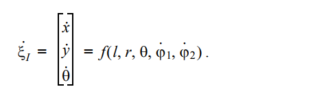

## ITI0201 Robotite Programmeerimine

---
### Liikumine, odomeetria ja juhtimine

---
## Meeleolu tekitamiseks...

---

---

---

---

---
## Ajakava

Nädal |  | Tegevus
------|--|--------
@size[large](**8**) | @size[large](@color[goldenrod](Loeng)) | @size[large](Liikumine, odomeetria ja juhtimine)
  | @size[large](@color[darkgreen](Praktikum)) | @size[large]("Objektid" arendamine ja kaitsmine)
  | @size[large](@color[cornflowerblue](Kodutöö)) | @size[large]("Objektid" arendamine)
@size[large](**9**) | @size[large](@color[goldenrod](Loeng)) | @size[large](---)
  | @size[large](@color[darkgreen](Praktikum)) | @size[large]("Objektid" arendamine ja kaitsmine)
  | @size[large](@color[cornflowerblue](Kodutöö)) | @size[large]("Objektid" arendamine)

---
### Objektid (3 nädalat)

Tase | Kirjeldus
-----|----------
@color[goldenrod](Pronks @size[smaller]([1. tase])) | 1 objekti leidmine ja juurde sõitmine.
@color[silver](Hõbe @size[smaller]([2. tase])) | 2 objektiga võrdkülgse kolmnurga moodustamine (robot on kolmas tipp)
@color[gold](Kuld @size[smaller]([3. tase])) | 3 objektiga ristküliku moodustamine
@color[firebrick](Eliit @size[smaller]([4. tase])) | Objekti haaramine ja transportimine määratud kohta

---
## Olekuautomaadid meeldetuletus

---?image=assets/image/fsm_elevator.png&size=auto 90%

---
## Liikumine

---
$$s=vt$$

Teepikkus on võrdne kiiruse ja aja korrutisega.

---
Millised probleemid on selle valemiga robootika kontekstis?

---
Roboti liikumist mõjutavad mitmed tegurid
@ul
- ükski elektriline või mehaaniline komponent ei ole täiesti identne teisega
- keskkond (pind, millel robot sõidab) mõjutab tegelikku kiirust
- konarused ja muud takistused mõjutavad kiirust
- mootorite toitepinge võib mõjutada pöörlemise kiirust
@ulend

---
Sellest tulenevalt roboti tegelik sõidukiirus (mootorite kiirused) ei ole päris elus sama juhtimiskäsuga püsivalt sama.

---
## Odomeetria

---
Roboti poosi (koordinaate ja orientatsiooni) kirjeldatakse 2D robotite korral kolme väärtusega:

**x koordinaat** *(meetrites)*

**y koordinaat** *(meetrites)*

**$\theta$ lengerdusnurk (yaw)** *(radiaanides)*

---
Kui on oluline ka kõrgus ja nurk 3-mõõtmelises maailmas, siis kirjeldatakse poosi nii:

**x, y, z koordinaat**

**pöörde- (roll), kallutus- (pitch) ja lengerdusnurk (yaw)**

---?image=assets/image/state.png&size=auto 70%
---?image=assets/image/state_vector.png&size=auto 30%
---?image=assets/image/90deg.png&size=auto 70%

---?image=assets/image/rotation.png&size=auto 30%

@snap[north]
2D-rotatsioonimaatriks (rotation matrix)
@snapend

@snap[south span-80]
@size[18px](Teisendus globaalsest teljestikust $${X_I, Y_I}$$ roboti teljestikku $${X_R, Y_R}$$)
@snapend

---?image=assets/image/state_derivative.png&size=auto 30%

@snap[north span-80]
Ettevaatav kinemaatikamudel (forward kinematic model)
@snapend

@snap[south span-80]
@size[18px](Võimaldab ennustada roboti liikumist globaalses teljestikus)
@snapend

---
@snap[north span-60]

@snapend
@ul
- l - ratta kaugus telje keskkohast
- r - ratta diameeter
- θ - roboti nurk
- φ1 - vasaku ratta kiirus
- φ2 - parema ratta kiirus
@ulend

---?image=assets/image/state_derivative_wheelspeed.png&size=auto 70%
---?image=assets/image/state_derivative_wheelspeed2.png&size=auto 70%

---
## Juhtimine (PID)

---
Avatud juhtimisahelaga (open loop)

*versus*

tagasisidestatud (closed loop) juhtimine.

---
Näiteid tagasisideta juhtimisest?
@ul
- röster
- veekeetja
- blender
- ...
@ulend

---
Kuidas sõita **täpselt**?

---
Juhime mootorite kiirust dünaamiliselt vastavalt hetkkiirusele.

---
Kuidas seda teha?

---
Kasutame tagasiside saamiseks rataste koodreid.

[https://github.com/iti0201/robot](https://github.com/iti0201/robot)

---?image=assets/image/closed_loop.png&size=auto 40%
---?image=assets/image/feedback_algo.png&size=auto 60%

---
### Näited "kauguse hoidja" ülesande põhjal

Algoritm peab hoidma roboti seinast kaugusel `r` meetrit.

---?image=assets/image/on_off_plot.png&size=auto 50%
---?image=assets/image/on_off_controller.png&size=auto 60%

---
## PID juhtimine

---
PID = proportsionaal-integraal-diferentsiaalregulaator ehk PID-kontroller

---?image=assets/image/p_controller.png&size=auto 50%
@snap[north]
Proportsionaalne (P) kontroller, P-regulaator
@snapend
---?image=assets/image/p_controller_neg_08.png&size=auto 70%
---?image=assets/image/p_gain.png&size=auto 70%

---
## Kuidas rakendada meie aine robotiga?

Note:

- Otse mootori kiirust juhtida ei ole regulaatoriga mõistlik (kaootiline ja lõhkuv)
- Juhtima peab "gaasipedaali" ja "piduripedaali" (kiiruse inkrementi)
- P=0.1, sp=100, pv=0, err=sp-pv, o=P*err=0.1*100=10 (% ??)
- P=0.01, sp=100, pv=0, err=sp-pv, o=0, u=P*err=0.01*100=1 (% !)
- P=0.01, sp=100, pv=200, err=sp-pv, o=15, u=P*err=0.01*-100=-1 (%)

---?image=assets/image/pi_algo.png&size=auto 60%
@snap[north]
@size[18px](Proportsionaalne-integraal kontroller ehk PI-kontroller, PI-regulaator)
@snapend
---?image=assets/image/pi_controller.png&size=auto 40%
---?image=assets/image/pi_plot.png&size=auto 60%

---?image=assets/image/pid_algo.png&size=auto 70%
@snap[north]
PID-kontroller
@snapend
---?image=assets/image/pid_controller.png&size=auto 10%
---?image=assets/image/pid_plot.png&size=auto 60%

---
PID-kontrolleri puhul on kõige olulisem valida sobiv komplekt võimendustegureid (*gain*).
@ul
- kui P võimendustegur on liiga väike, siis võib reguleerimine jääda ka liiga väikeseks, kui süsteemile mõjuvad häiringud
- kui P võimendustegur on liiga suur, siis tekivad ostsillatsioonid (ebastabiilne juhtimine)
- kui I võimendustegur on liiga suur, siis tekivad ostsillatsioonid
- kui D võimendustegur on liiga suur, siis kontroller reageerib kergesti mürale
@ulend

---
Hea juhtimisalgoritm
@ul
- Hea juhtimisalgoritm peaks kiiresti koonduma ja vältima järske muutusi.
- Juhtimisalgoritm tuleb valida ja kohandada vastavalt süsteemile.
@ulend

---
## Näide: püsikiirusehoidja

---?image=assets/image/cruise_diagram.png&size=auto 60%
---?image=assets/image/cruise_slope.png&size=auto 60%
---?image=assets/image/cruise_fsm.png&size=auto 50%

---
Tagasisidestatud süsteemide kohta võit juurde lugeda siit:

[http://www.cds.caltech.edu/~murray/amwiki/index.php/Second_Edition](http://www.cds.caltech.edu/~murray/amwiki/index.php/Second_Edition)

---
## Koordinaatsüsteemid

---?image=assets/image/frames.png&size=auto 70%
---?image=assets/image/frames2.png&size=auto 30%
---?image=assets/image/frames3.png&size=auto 70%
---?image=assets/image/frames_cyclic.png&size=auto 70%

---
## Kuidas tuvastada objekte?

---?image=assets/image/object_detection.png&size=auto 70%

---
## Lisamaterjalid

Võite huvi korral lugeda "õpikust" (Elements of Robotics) juurde

- 5\. peatükk - **Robotic Motion and Odometry**
- 6\. peatükk - **Control**
